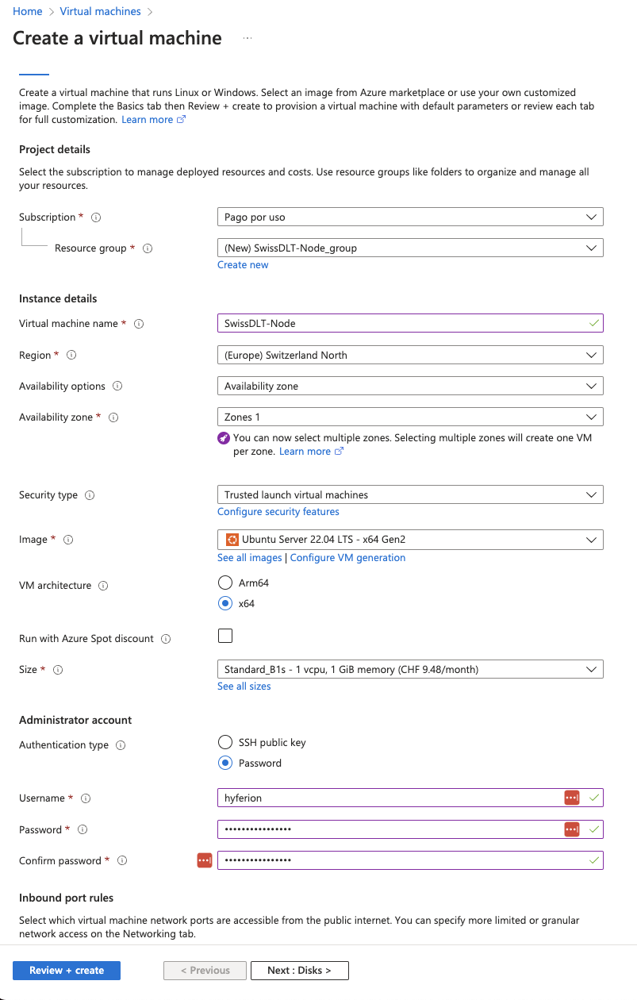
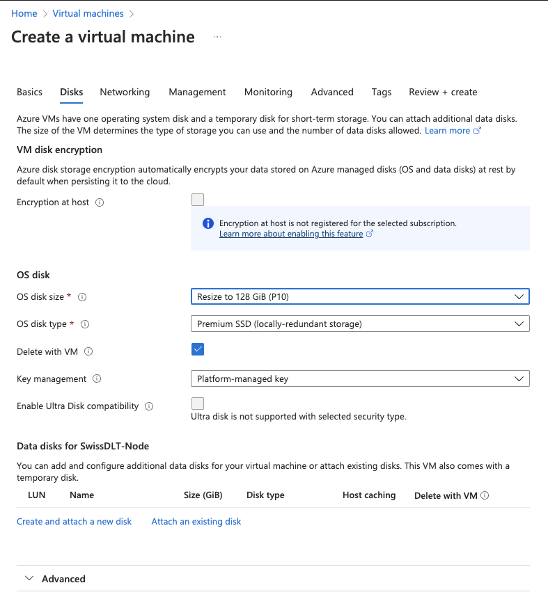

# Setting Up a Node

Although setting up a signer node may seem technically challenging, we've simplified the process as much as possible. If you need further clarification or encounter any issues, don't hesitate to contact me at [silas.stulz@bcts.ch](mailto:silas.stulz@bcts.ch?subject=SwissDLT%20Setup%20Support).

You can run a SwissDLT node in one of two ways: in a container or via source installation. Both methods require setting up a Virtual Machine (VM).

## 1. Virtual Machine Setup

### 1.1 Azure

#### 1.1.1 Creating a VM

**BASICS**

Create a new VM in Azure with the following properties:

- **Resource group** Create a new one.
- **Region**: (Europe) Switzerland North
- **Image**: Ubuntu Server 22.04 LTS
- **VM Architecture**: x64
- **Size**: Minimum "B1ms", but "B2s" or similar is recommended.
- **Authentication type**: If you're familiar with SSH certificates, please create one and use it. However, password-based access is also acceptable.



Keep the default settings for the other fields. Proceed to the "Disks" section.

**DISKS**

- **OS disk size**: 128 GiB. This should provide ample space for the growing blockchain.



Keep the default settings for the other fields. Proceed to "Networking".

**NETWORKING**

A virtual network, a subnet, and a public IP should be assigned by default. If there's no virtual network assigned, create a new one. Click "Create new", enter a name, and leave the rest as is. This action should automatically set a subnet and a public IP.


Keep the default settings for the other fields and proceed to "Review + create". If there are no errors, create the VM.

#### 1.1.2 Opening Required Ports

- Navigate to your newly created VM.
- Click the "Networking" tab.
- Select "Add inbound port rule".
- In "Destination port ranges", enter **30300-30310**.
- Click "Add".

Your VM can now connect to other nodes. Let's continue with the final setup. Proceed to Chapter 2.

### 1.2 AWS

## 2. Virtual Machine Installation

- Connect to your virtual machine (the one you just set up) via SSH. You can find that information under the "Connect" tab on Azure

  ```ssh username@ip``` 


- Clone the git repository:

  ```git clone https://github.com/BlockchainTrustSolutions/SwissDLT-Node-Setup```


- Navigate to the cloned repository:

  ```cd SwissDLT-Node-Setup/```

Depending on whether you want to run a signer node or an just an archive node, you need to run a different script.

<b>For a signer node:</b>

- Make the script executable:

  ```chmod +x signer_setup.sh```


- Run the script, replacing "YOUR_PASSWORD" with a password of your choosing (This password will protect your wallet). It's important the password is wrapped in single quotes ''.:

  ```sudo ./signer_setup.sh 'YOUR_PASSWORD'``` e.g. ```sudo ./signer_setup.sh '123'```

<b>For an archive node:</b>

- Make the script executable:

  ```chmod +x archive_node_setup.sh```


- Run the script, replacing "YOUR_PASSWORD" with a password of your choosing (This password will protect your wallet). It's important the password is wrapped in single quotes ''.:

  ```sudo ./archive_node_setup.sh 'YOUR_PASSWORD'``` e.g. ```sudo ./archive_node_setup.sh '123'```

- During the script execution, confirm any operations by responding with "yes" or "y".

Continue here for both signer and archive:

- If successful, your public key should be displayed. For instance: 0x453BF47b6c8E9b466f463D1b1D487C9aC35A952B


- If you don't see this output, check the account.txt file:

  ```cat account.txt```


- Please share the public key with Toni or Silas, so we can add you as a signer. (Only for signers)


- To verify everything is running correctly, enter:

  ```systemctl status geth```


- Under the section "Active" it should be written a green "active (running)".


- You can also check the logs by entering:

  ```journalctl -u geth -n 20```


- If you see messages like "Imported new chain segment" and "Looking for peers", everything seems to be in order.

Congratulations! You're now running a node in the SwissDLT network!

(Optional) As a last step you should backup your private key file from your server to your local machine.

- Go to your keystore <br>
  ```cd data/keystore```
- Look at your files <br>
  ```ls```
- There should only be one file. Show the contents of that file.<br>
  ```cat <filename>``` You should be able to press TAB after typing "cat" and it should autofill the rest.

If you have problems with the permission:

- Show the filename <br>
  ```sudo ls data/keystore```

- Copy the filename and add it here instead of <filename> <br>
  ```sudo cat data/keystore/<filename>```

Now just copy the content displayed with Ctrl+C and paste it on your local computer into a notepad and save it as a .json file. Please keep this file somewhere save. With that file and your chosen password it is possible to access or restore the wallet.

## 3. Docker Setup

Coming Soon!